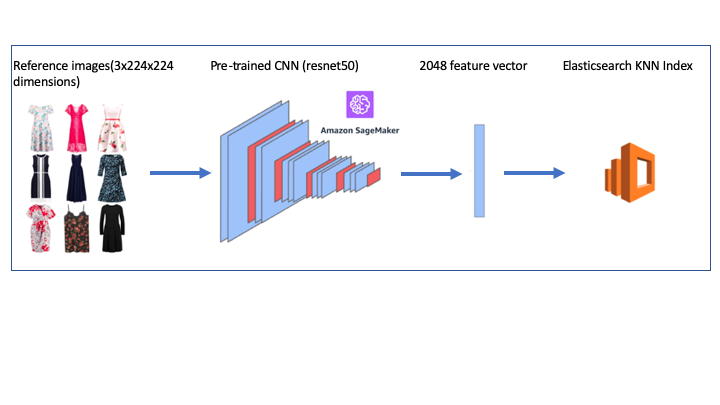
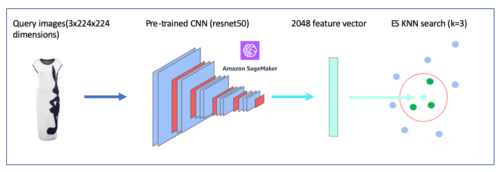
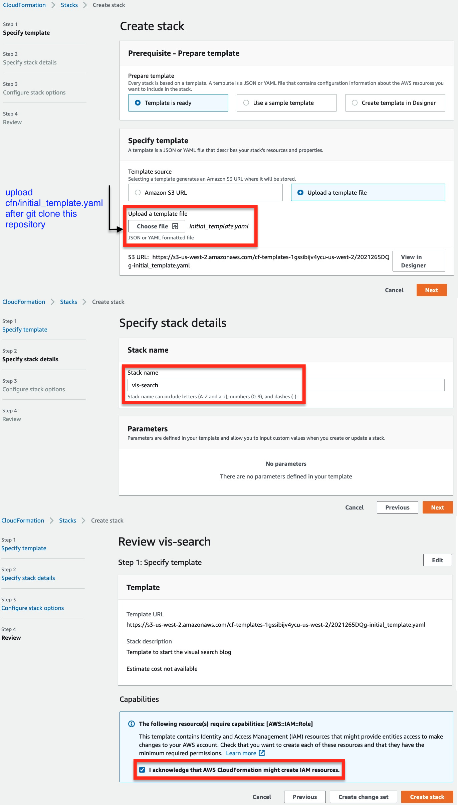
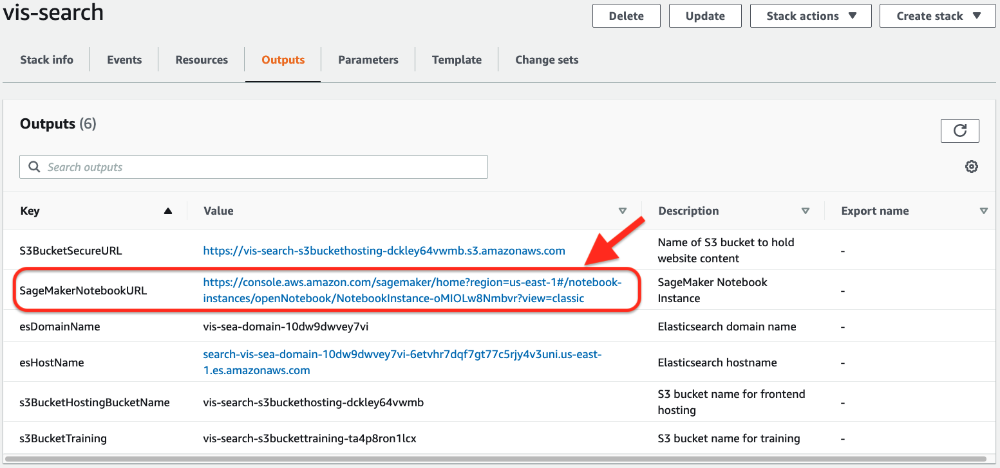

## Visual image search
This repository is [part of AWS blog](https://aws.amazon.com/blogs/machine-learning/building-a-visual-search-application-with-amazon-sagemaker-and-amazon-es/) to create a visual search application using Amazon SageMaker and Amazon Elasticsearch

## How does it work?

We will use Fashion Images from feidegger, a zalandoresearch dataset as a reference image to generate a 2048 feature vector using a convolutional neural networks and gets stored into Amazon Elasticsearch KNN index

When we present a new query image, it's computing the related feature vector from Amazon SageMaker hosted model and query Amazon Elasticsearch KNN index to find similar images

## Deploy

You use a CloudFormation stack to deploy the solution. The stack creates all the necessary resources, including the following: 

 + An Amazon SageMaker notebook instance to run Python code in a Jupyter notebook
 + An IAM role associated with the notebook instance
 + An Amazon ES domain to store and retrieve image embedding vectors into a KNN index
 + Two S3 buckets: one for storing the source fashion images and another for hosting a static website

From the Jupyter notebook, you also deploy the following: 

 + An Amazon SageMaker endpoint for getting image feature vectors and embeddings in real time.
 + An AWS SAM template for a serverless back end using API Gateway and Lambda.
 + A static front-end website hosted on an S3 bucket to demonstrate a real-world, end-to-end ML application. The front-end code uses ReactJS and the Amplify JavaScript library.

To get started, complete the following steps: 

  1. Sign in to the [AWS Management Console](https://aws.amazon.com/console/) with your IAM user name and password.
  2. Choose **Launch Stack** and open it in a new tab: 
    

    

  
  3. Wait for the stack to complete executing. 
    When the stack creation is complete, you see the status **CREATE_COMPLETE**. 
    You can look on the **Resources** tab to see all the resources the CloudFormation template created.

  4. On the **Outputs** tab, choose the **SageMakerNotebookURL** value. 
     This hyperlink opens the Jupyter notebook on your Amazon SageMaker notebook instance that you use to complete the rest of the lab.

    

## License

This library is licensed under the MIT-0 License. See the LICENSE file.
